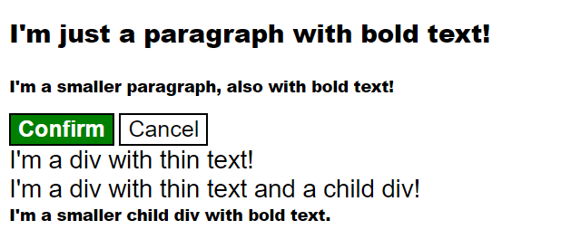

# CSS Methods

This final exercise for CSS Foundations is going to give you a closer look at the cascade, in particular specificity and rule order. Both the HTML and CSS files are filled out for you, so instead of adding rules yourself, you will simply be editing what is provided.

There are a few elements that have some sort of specificity or rule order issue in the provided CSS file. It's up to you to figure out what issue is affecting an element, and how to fix it. You can edit the CSS file by adding, removing, or editing selectors for a declaration block, or by moving declaration blocks around. **You should not edit the HTML file or any of the actual styles in the CSS**.

There are multiple ways to solve this exercise, and we did our best to include all of the possible solutions for each element.

Issues with the cascade can be the bane of their existence for many when it comes to CSS. While you won't become a cascade expert from this exercise alone, and there are other ways to deal with these issues, it is still super helpful to see how these issues affect our final styles and why it's important to order rules carefully.

## Desired Outcome

### Self Check
<<<<<<< HEAD
<<<<<<< HEAD
- Did you make sure to not edit the HTML file?
- If you added selectors to the CSS, do they target a valid HTML element?
<<<<<<< HEAD
=======
- Do all rules for elements labeled "Fix specificity" have the correct selector added or removed?
- Are all rules for elements labeled "Fix rule order" placed at the end of the CSS file and in the correct order?
>>>>>>> refs/rewritten/Merge-remote-into-local
=======

<<<<<<< HEAD
_Note: this exercise has had its style changed, for accessibility reasons. For new and old students, we propose to carry out the exercise noting how important it is to pay attention to the accessibility of the web, and we encourage more and more practices like this._
>>>>>>> b919b54 (Update for accessibility)
=======
_Note: for accessibility reasons, the style in this exercise has changed. For new and old students, we propose to carry out the exercise noting how important it is to pay attention to the accessibility of the web, and we encourage more and more practices like this._
>>>>>>> 9bf194d (Update cascade-fix/README.md)
=======

- Did you make sure to not edit the HTML file?
- If you added selectors to the CSS, do they target a valid HTML element?
>>>>>>> 7a8eeeb (Remove Unnecessary Accessibility Note)
